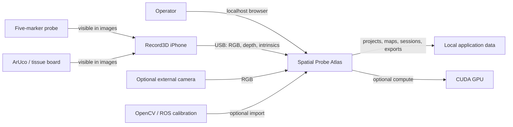
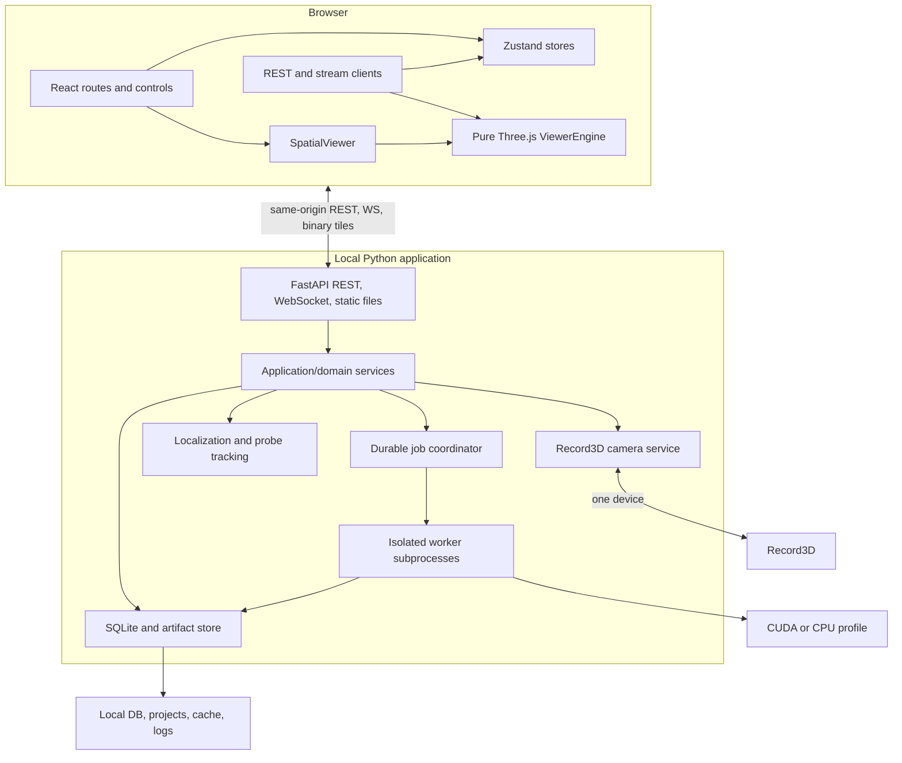
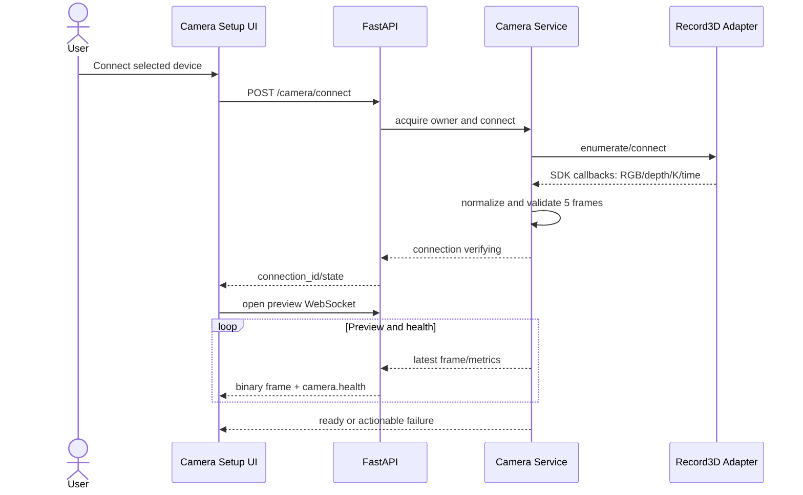
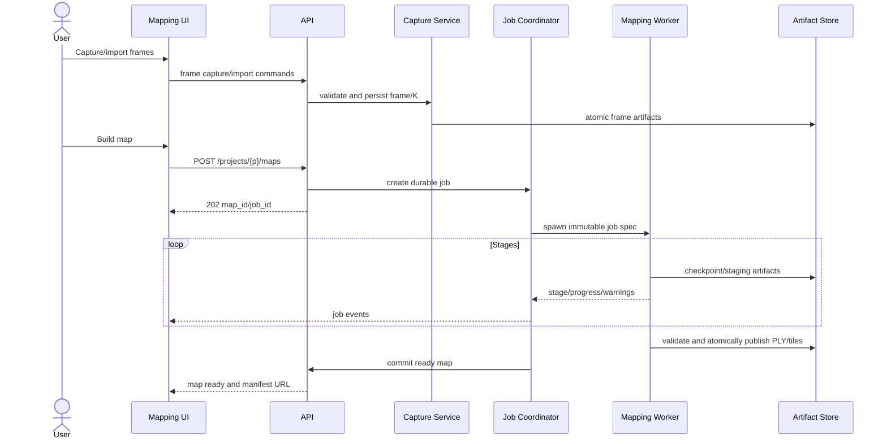
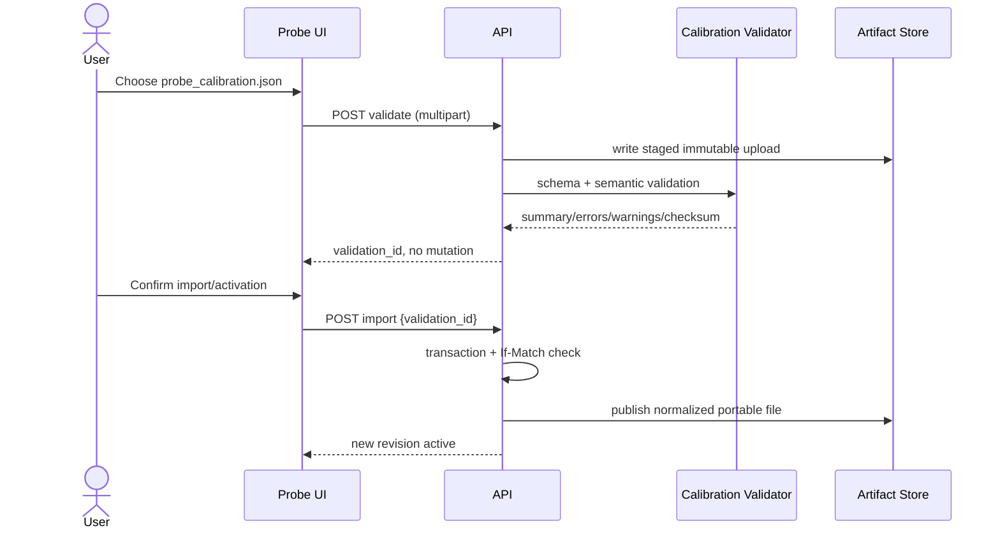
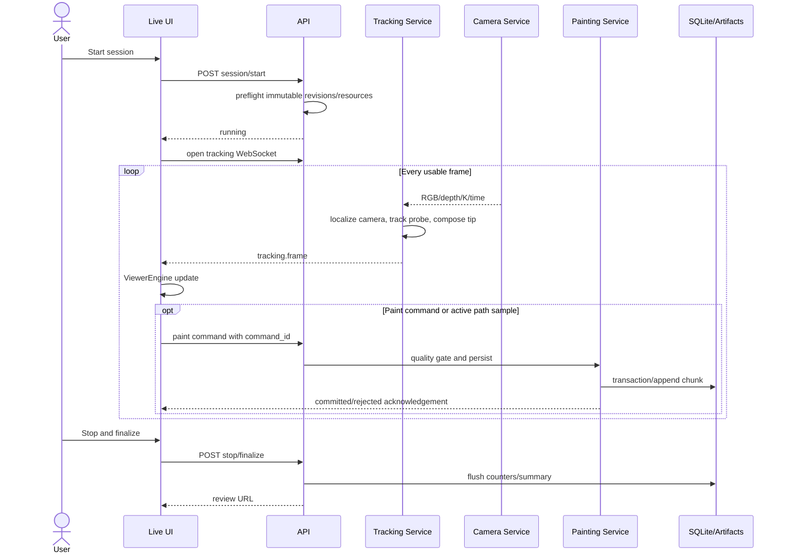
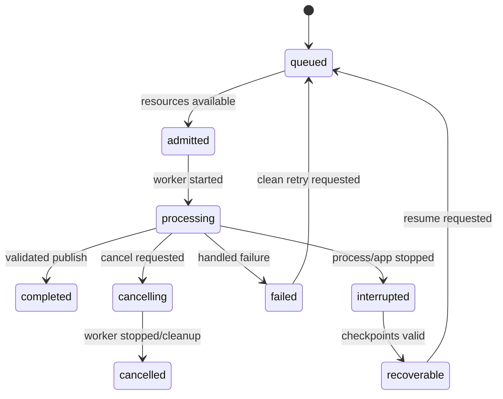

# Spatial Probe Atlas — Architecture Specification

**Status:** Proposed v1 architecture  
**Document version:** 1.0  
**Target:** Windows local-first browser application  
**API prefix:** `/api/v1`  
**Architecture:** Modular monolith with supervised local worker processes

## 1. Executive summary

Spatial Probe Atlas is a complete rewrite of the AR tissue/probe-tracking prototype. It builds a point-cloud reference map, connects one Record3D iPhone, calibrates and tracks a five-marker probe, registers the probe and tissue/board frames to the map, paints probe-tip points or paths, and supports local review and export.

The production application is one localhost Python application. FastAPI serves a built React frontend, REST APIs, WebSockets, point-cloud tiles, and exports. SQLite owns durable metadata and lifecycle state; large images, COLMAP/SfM artifacts, point clouds, calibration files, and exports remain as inspectable files. Heavy reconstruction and export work runs in supervised subprocesses so native-library or GPU failures cannot take down the web server.

The frontend uses React, TypeScript, Vite, React Router, Zustand, and pure Three.js. One framework-independent `ViewerEngine` owns all 3D logic. React mounts and controls it only through `SpatialViewer`, reused in `mapping`, `registration`, `live`, and `review` modes.

Record3D is the primary camera and its per-frame intrinsics are authoritative. There is no Record3D camera-calibration workflow. Optional external cameras may import OpenCV JSON/YAML or ROS `camera_info.yaml`, normalized to one internal schema.

V1 intentionally excludes spectrometers, FBG sensors, temperature, classification, meshes, GLB, Gaussian splatting, cloud accounts, and multi-user operation.

## 2. Product scope, assumptions, and design principles

### 2.1 V1 scope

1. Create, open, clone, archive, restore, and inspect projects.
2. Connect one Record3D device; verify RGB, depth, per-frame intrinsics, frame rate, latency, and health.
3. Capture or import scene frames and build an SfM point-cloud reference map.
4. Create, validate, import, activate, and download reusable probe calibrations.
5. Tune every supported OpenCV `SimpleBlobDetector` parameter using live diagnostic views.
6. Register map, board/tissue, probe marker, and tip frames; solve and validate physical scale.
7. Localize the live camera, track the probe, and calculate the probe tip in map coordinates.
8. Persist individual points or sampled paths with quality metrics and timestamps.
9. Review, filter, annotate, soft-delete, restore, and export sessions.
10. Display frame count, map point count, project/session size, session duration, processing state, compute mode, and practical resource warnings.

### 2.2 Assumptions

- Windows 10/11 x64; localhost binding only by default.
- One application instance owns a data root; one camera and one active acquisition owner at a time.
- Record3D supplies synchronized RGB, depth, and intrinsics. Incomplete frames are rejected or explicitly marked.
- Metres are authoritative; the UI may display millimetres.
- SfM begins at arbitrary scale. A validated similarity registration makes the published map metric.
- A project has no configured size ceiling. Operations remain constrained by available disk, RAM, VRAM, browser limits, and time; warnings and admission checks expose those constraints.
- Runtime is offline. Internet is used only for setup/update or explicit model download.

### 2.3 Design principles

- Pages follow user tasks, not algorithms or backend modules.
- Project identity appears in every project-scoped API; there is no global “active project” backend variable.
- SQLite owns identity, relationships, revisions, and lifecycle; files own large immutable artifacts; versioned JSON owns portable calibration interchange.
- Transform names always identify destination and source frames.
- Raw frames, point buffers, and Three.js objects never pass through Zustand.
- Jobs checkpoint, write into staging, validate, and publish atomically.
- GPU improves performance but is not required for correctness. CPU mode uses an explicit practical pipeline.
- Projects remain locally inspectable and backup-friendly.
- Future extension points must not create plugin UI, a generic event bus, or unused abstractions in v1.

## 3. Technology stack and rationale

| Layer | Decision | Reason |
|---|---|---|
| Frontend | React, TypeScript, Vite | Typed workflow UI and static production build. |
| Routing | React Router | Nested project workflow routes, guards, and deep-linked review. |
| State | Zustand | Small explicit stores without pushing high-rate data through React. |
| 3D | Pure Three.js | Direct LOD, render-loop, buffer, transform, picking, and disposal control. |
| Backend | Python 3.11, FastAPI, Uvicorn | Compatible with CV/SfM ecosystem; typed REST, OpenAPI, WebSockets, static serving. |
| Validation | Pydantic v2, JSON Schema Draft 2020-12 | API and portable-file validation. |
| Metadata | SQLite WAL, SQLAlchemy 2, Alembic | Durable local transactions and migrations without a database service. |
| Vision | OpenCV, NumPy, SciPy | Blob detection, PnP, calibration, optimization, transforms. |
| Mapping | hloc plus pycolmap/COLMAP-compatible pipeline | Learned GPU profile and classical CPU profile. |
| GPU | PyTorch CUDA when verified | Optional acceleration with explicit fallback. |
| Tests | Pytest, Vitest, React Testing Library, Playwright | Unit, API, browser, replay, and hardware coverage. |

### 3.1 Version policy

- Support one tested Python line (`3.11.x`) and Node LTS line (`22.x`) per release.
- Pin accepted runtime builds and SHA-256 hashes in `tools/runtime-manifest.json`.
- Lock every Python dependency and hash in `requirements-cpu.lock.txt` and `requirements-cuda.lock.txt`.
- Commit `package-lock.json`; use `npm ci`; application dependencies use exact versions without `^` or `~`.
- Pin hloc/LightGlue integrations to releases or commit SHAs and model assets to checksums.
- Updates ship as tested application releases, never uncontrolled package upgrades.

### 3.2 Rejected choices

No Docker, Electron, React Three Fiber core, Redis, Celery, microservices, external database, or point-cloud JSON. These increase operational or rendering complexity without helping a one-user Windows application.

## 4. System-context diagram



## 5. High-level architecture



## 6. Frontend architecture

### 6.1 Routes

```text
/
└── /projects
    └── /projects/:projectId
        ├── /camera
        ├── /mapping
        ├── /registration
        ├── /live
        └── /sessions/:sessionId/review
/settings
```

`/` redirects to `/projects`. `ProjectLayout` supplies project context, workflow stepper, status bar, resource warnings, route error boundary, and unsaved-change guard. Guards explain unmet prerequisites and link to the required page rather than hiding later pages.

### 6.2 Zustand stores

| Store | Owns | Excludes |
|---|---|---|
| `useUiStore` | Theme, panels, dialogs, toasts, display units, draft flags | Frames, point buffers, Three.js objects |
| `useProjectStore` | Projects, active project, summaries, active map/calibration/registration IDs, readiness | Artifact content |
| `useCameraStore` | Device/connection state, health and frame summaries, preview options | Raw image/depth buffers |
| `useJobStore` | Job snapshots, stage, progress, warnings, cancellation | Worker processes and full logs |
| `useLiveSessionStore` | Session lifecycle, painting mode, counters, quality summary, reconnect state | Every tracking frame and geometry |
| `useReviewStore` | Filters, selection, paging, replay state | Authoritative records |
| `useDiagnosticsStore` | Capabilities, resource snapshots, component health | Configuration writes outside typed actions |

Selectors must be narrow. High-rate stream clients keep a latest-value buffer and send frames directly to the viewer or preview component.

### 6.3 Component hierarchy

```text
App
├── BootstrapGate
├── BrowserRouter
│   ├── RootLayout
│   │   ├── AppTopBar
│   │   ├── GlobalErrorBoundary
│   │   └── Outlet
│   ├── ProjectsPage
│   ├── ProjectLayout
│   │   ├── WorkflowStepper
│   │   ├── CameraSetupPage
│   │   ├── MappingPage → SpatialViewer(mode="mapping")
│   │   ├── ProbeRegistrationPage
│   │   │   ├── SpatialViewer(mode="registration")
│   │   │   └── BlobDetectorTuningModal
│   │   ├── LivePaintingPage → SpatialViewer(mode="live")
│   │   └── SessionReviewPage → SpatialViewer(mode="review")
│   └── SettingsDiagnosticsPage
└── ToastViewport
```

Page components coordinate layout and application commands. They contain no camera, transform, tracking, or Three.js algorithms.

### 6.4 `SpatialViewer` wrapper

```tsx
type SpatialViewerProps = {
  mode: "mapping" | "registration" | "live" | "review";
  projectId: string;
  mapId: string;
  sessionId?: string;
  selection?: ViewerSelection;
  onSelectionChange?: (value: ViewerSelection) => void;
  onMetrics?: (value: ViewerMetrics) => void;
  className?: string;
};
```

The wrapper creates one engine after its container has non-zero dimensions, loads a typed `ViewerDataSource`, translates low-frequency props into idempotent commands, throttles metrics callbacks, observes resize/visibility/context loss, and calls `dispose()` exactly once. It does not expose the scene or recreate the engine for filter changes.

### 6.5 Pure Three.js `ViewerEngine`

```ts
interface ViewerEngine {
  initialize(container: HTMLElement, options: ViewerOptions): Promise<void>;
  setMode(mode: ViewerMode): void;
  loadMap(source: PointCloudSource): Promise<void>;
  setRegistration(value: RegistrationView): void;
  applyTrackingFrame(value: TrackingViewFrame): void;
  setPaintData(value: PaintDataDelta): void;
  setFilters(value: ViewerFilters): void;
  setSelection(value: ViewerSelection): void;
  resize(width: number, height: number, dpr: number): void;
  getMetrics(): ViewerMetrics;
  resetView(): void;
  dispose(): void;
}
```

The engine is the single owner of:

- Scene, renderer, render camera, controls, clock, render loop, adaptive pixel ratio, and context recovery.
- Point-cloud tiling, worker decoding, GPU buffer pool, LOD, frustum culling, materials, colour modes, and picking acceleration.
- Probe model, tip glyph, camera frustum, coordinate frames, board/tissue frame, registration residuals, overlays, painted points, and paths.
- 3D transform graph, raycasting, selection, nearest-point queries, and interaction controllers.
- Geometries, materials, textures, workers, animation frames, controls, listeners, abort controllers, and deterministic disposal.

Only `ViewerEngine` mutates Three.js transforms or GPU buffers.

### 6.6 Viewer modes

| Mode | Layers and interactions | Priority |
|---|---|---|
| `mapping` | Point cloud, capture frusta, coverage; orbit, inspect, frame selection, LOD/point controls | Reconstruction inspection |
| `registration` | W/B/M/P frames, board, probe, correspondences, residuals; picking and provisional transform manipulation | Local precision |
| `live` | Point cloud, camera/probe/tip, quality state, recent points/path; paint and focus controls | Stable frame time; drop stale frames |
| `review` | Persisted points/paths, camera trail, filters, selection, timeline replay | Progressive filtered loading |

### 6.7 Stream handling

- `CameraStreamClient`, `TrackingStreamClient`, and `JobEventClient` are independent.
- High-rate buffers have capacity one. Slow clients drop stale frames and expose counters.
- Web Workers decode binary images/tiles; transfer buffers and close `ImageBitmap` promptly.
- Tracking frames go directly to `ViewerEngine`; Zustand receives a summary at no more than 10 Hz.
- Paint records are server-authoritative. Provisional markers are replaced or removed on acknowledgement.
- Sequence gaps trigger a REST snapshot before stream continuation.
- Reconnect backoff is 0.5, 1, 2, 4, then 5 seconds with jitter. Reconnect never creates a new session.
- Background tabs pause preview decoding/rendering. Live session continuation requires explicit user preference.

### 6.8 Page specifications

Every project page has a persistent project/session header, Record3D status, active compute mode, processing state, project size, and warnings. Logs are secondary and collapsed by default.

#### 6.8.1 Projects & Sessions

- **Purpose:** Establish context and resume work.
- **Layout:** Header with **New Project** and data-root usage; project table/cards showing map/session readiness; selected-project drawer with sessions/jobs.
- **Primary actions:** Create, open, rename, clone, archive/restore, reveal directory, review a session, resume a job.
- **States:** Skeleton list while loading; first-project call to action when empty; database/data-root errors retain read-only recovery and diagnostics links; corrupt projects are quarantined, not omitted.
- **Validation:** Names are 1–80 visible characters; trim whitespace; reject control characters and Windows reserved names. Clone requires a free-space estimate plus reserve.
- **Data:** Project/session counts, frame and point counts, size, duration, active revisions, job state, timestamps, warnings.
- **API:** Project CRUD/clone/archive/restore/summary, session list, job list, legacy import.
- **Entry/exit:** Application ready → valid project chosen, then Camera Setup or Review.

#### 6.8.2 Camera Setup

- **Purpose:** Connect Record3D and prove RGB, depth, intrinsics, and health are usable.
- **Layout:** Large RGB/depth preview; device/connect panel; health checklist; intrinsics, resolution, FPS, latency, frame/drop counts; secondary external-calibration importer.
- **Primary actions:** Enumerate, connect/disconnect/retry, select preview quality, verify depth, validate/import/activate optional external calibration.
- **States:** Explicit `enumerating`, `opening`, `waiting_for_frame`, `verifying`, `ready`; no-device state gives cable/unlock/Record3D/trust checklist; errors distinguish SDK, busy, stopped, malformed, and timeout cases.
- **Validation:** Five consecutive complete monotonic frames; finite positive focal lengths; plausible principal point; declared RGB/depth alignment; sustained FPS warning. External files pass schema and resolution checks.
- **Data:** Device, RGB/depth dimensions, intrinsics source/matrix, distortion source, FPS, latency, frame/drop/incomplete counts, connection duration.
- **API:** Camera devices/status/connect/disconnect, preview WebSocket, camera-calibration validate/import/activate.
- **Entry/exit:** Active project → Record3D `ready`, or supported external camera plus compatible calibration.

Record3D always displays **Intrinsics supplied per frame** and never a calibration wizard.

#### 6.8.3 Scene Capture & Mapping

- **Purpose:** Acquire a quality frame set and publish a point-cloud reference map.
- **Layout:** `SpatialViewer(mode="mapping")`; live capture strip; coverage/blur indicators; frame-set and reconstruction side panel; durable progress; collapsible frame browser/logs.
- **Primary actions:** Manual/interval/motion capture, import, exclude/restore frames, create/cancel/resume reconstruction, inspect and activate map.
- **States:** Incremental thumbnails and tiles; empty choice between Record3D capture and import; failures retain successful stage artifacts and old active map, with retry/restart/diagnostic actions.
- **Validation:** Default minimum 20 accepted frames and warning below 30; reject corrupt/duplicate images; require matching per-frame intrinsics; warn on blur, exposure, weak coverage/baseline, disk reserve, and CPU time.
- **Data:** Captured/accepted/excluded frames, coverage, registered images, points, reprojection error, job duration/stage, map/project bytes, resource estimate, compute profile.
- **API:** Capture-set/frame endpoints, map job, jobs/events, map metadata/manifest/tiles/activation.
- **Entry/exit:** Ready camera or valid import → validated map published. Metric registration is still required for Live.

#### 6.8.4 Probe & Registration

- **Purpose:** Establish reusable probe geometry/detection settings and metric map/board/probe/tip relationships.
- **Layout:** Status cards for active calibration, `5/5 tracked`, calibration error, registration RMS/max residual and scale; live test; calibration capture/upload; `SpatialViewer(mode="registration")`; registration stepper; prominent **Can’t track the probe?** button.
- **Primary actions:** Test tracking, capture/upload images, create calibration, validate/import/activate/download `probe_calibration.json`, tune blobs, register board/tissue, select correspondences, solve/validate/activate scale and registration.
- **States:** Independent map/camera/calibration loading; empty create-or-import choice; failures preserve saved settings, staged import, and correspondences while explaining high residual, degenerate geometry, or scale mismatch.
- **Validation:** Imported files must pass structural, semantic, unit, transform, five-point geometry, and detector-range checks before replacement. Calibration needs at least 3 valid views and recommends 15–25. Registration requires non-degenerate observations, positive scale, recorded validation, and acceptable residuals or explicit warning acceptance.
- **Data:** Calibration identity/version/provenance, marker positions, tip transform, all detector settings, source frames/error, blob/inlier counts, probe error, board detections, scale, RMS/max residual, validation observations.
- **API:** Probe calibration/capture/job/validate/import/download/activate/revision endpoints; tuning and test WebSockets; board and registration endpoints.
- **Entry/exit:** Active map → active valid probe calibration plus active metric registration marked `passed` or `accepted_with_warning`.

**Advanced blob-detector modal**

- Shows synchronized raw Record3D, threshold/binary, and detected-overlay views; blob/candidate count, `5/5 tracked`, inliers, reprojection error, and specific rejection/exposure feedback.
- Exposes: `minThreshold`, `maxThreshold`, `thresholdStep`, `minRepeatability`, `minDistBetweenBlobs`, `filterByColor`, `blobColor`, `filterByArea`, `minArea`, `maxArea`, `filterByCircularity`, `minCircularity`, `maxCircularity`, `filterByInertia`, `minInertiaRatio`, `maxInertiaRatio`, `filterByConvexity`, `minConvexity`, and `maxConvexity`.
- Changes are an ephemeral draft applied live through the tuning WebSocket. Disabled filter groups remain visible with dependent inputs disabled.
- **Reset to defaults** and **Import settings** alter only the draft. **Save to current project** creates and atomically activates a calibration revision containing geometry and settings. **Download settings** downloads the complete calibration JSON.
- Cancel, Escape, backdrop click, or close never save. If dirty, offer **Discard**, **Keep editing**, or **Save**; discard restores the active saved detector configuration.

#### 6.8.5 Live Tissue Painting

- **Purpose:** Run a monitored session and persist probe-tip points/paths.
- **Layout:** Dominant `SpatialViewer(mode="live")`; compact image overlay; session controls/duration; localization, probe, position, paint mode, sampling, and counts panel; recent-event table.
- **Primary actions:** Start, pause/resume, save point, start/stop path, choose time/distance sampling, undo last item, focus probe, note, stop/finalize.
- **States:** Preflight checklist before Start; unmet-prerequisite empty state; tracking loss auto-pauses painting; camera loss enters degraded/reconnecting; fatal failure preserves committed records and a recoverable session.
- **Validation:** Samples require localized camera, tracked probe, finite transforms, monotonic timestamp, map bounds, and quality thresholds. Paths deduplicate jitter. Explicit low-quality point override requires a reason.
- **Data:** Camera/probe/tip overlays, frame/point/path counts, duration/size, FPS/drops, inliers/errors, latency, coordinates, disk/RAM/VRAM warnings.
- **API:** Session lifecycle/snapshot, tracking WebSocket, paint commands/acks, recent records.
- **Entry/exit:** Camera, map, calibration, registration, storage, and camera-owner preflight pass → finalized or recoverable stopped session.

#### 6.8.6 Session Review & Export

- **Purpose:** Inspect, filter, annotate, replay, and export persisted data.
- **Layout:** `SpatialViewer(mode="review")`; filter/legend and selected-record inspector; timeline and paged table; export drawer.
- **Primary actions:** Filter time/type/quality, select/replay, annotate, soft-delete/restore, compare, create/cancel/retry/download exports.
- **States:** Summary first, paint chunks second, map tiles progressively; valid empty session view; corrupt artifacts are isolated and repair/reindex runs as a non-destructive job.
- **Validation:** Valid UTC ranges, bounded notes, soft deletion until purge, and exports record schema, frame, units, filters, and checksums.
- **Data:** Duration/size/frames, tracked/lost ratio, point/path counts, quality distributions, selected coordinates/time/metrics/notes, map points, exports.
- **API:** Session summary, paged paint/replay chunks, annotation/delete/restore, export jobs/download.
- **Entry/exit:** Existing session; active session is read-only → no required exit.

#### 6.8.7 Settings & Diagnostics

- **Purpose:** Surface operational health and infrequent configuration.
- **Layout:** Health summary; compute/device/dependency/model/storage/port cards; resource charts; settings; logs and support bundle.
- **Primary actions:** Refresh/run diagnostics, select compute profile, adjust budgets/units, migrate data root, reveal logs, create support bundle, reset preferences.
- **States:** Each probe loads and fails independently; unavailable capability displays `not_available` plus impact/fix.
- **Validation:** Writable local data root with atomic-write test and no install/temp overlap; safe budget bounds; CUDA selectable only after backend verification.
- **Data:** App/API/schema/runtime versions, GPU/CUDA/driver, CPU/RAM/VRAM/disk, Record3D SDK/device, checksums, DB state, paths, ports, logs.
- **API:** Capabilities/resources/diagnostics/settings, support-bundle and data-root migration jobs, redacted log tail.
- **Entry/exit:** Bootstrap complete even if degraded → settings persisted; restart-required changes are explicit.

## 7. Backend architecture

### 7.1 Service boundaries

| Boundary | Responsibility |
|---|---|
| API | Transport, run-session authentication, validation, OpenAPI, correlation IDs, response mapping. |
| Application services | Use-case orchestration, project authorization, state machines, transactions, idempotency. |
| Domain | Entities, value objects, transform/quality rules, schema policy. |
| Camera | Exclusive ownership, Record3D lifecycle, normalization, bounded fan-out, health. |
| Capture | Acceptance/quality, intrinsic snapshots, atomic persistence. |
| Mapping | Job specification, compute profile, output validation/publication. |
| Probe | Calibration revisions, tuning drafts, detection tests, import/export, optimization. |
| Registration | Observations, similarity/rigid solve, residuals, scale validation. |
| Tracking | Reference localization, blob/PnP tracking, transform composition, quality. |
| Painting | Point/path state machine, sampling, quality gates, persistence. |
| Review/export | Queries, replay, annotations, soft deletion, exports/checksums. |
| Job coordinator | Durable queue, subprocess supervision, progress, cancellation, recovery. |
| Persistence | SQLAlchemy repositories, artifact store, atomic writes, migrations. |
| Observability | Logs, metrics, diagnostics, redaction, support bundle. |

Domain modules do not import FastAPI or concrete device/filesystem adapters.

### 7.2 Process and concurrency model

- Main Uvicorn process: API, built frontend, camera acquisition, live tracking, SQLite, and job coordination.
- OS data-root lock prevents two writers. A second `run.bat` opens the current instance or reports its URL.
- Reconstruction, tiling, legacy import, large export, repair, and data-root migration use spawned subprocesses with immutable job specs and structured progress.
- One heavy job runs by default; lightweight jobs may run if admission checks pass.
- One camera acquisition loop fans out bounded subscriptions for preview, capture, tuning, registration, and tracking. Live tracking and tuning are mutually exclusive.
- High-rate tracking frames are ephemeral unless they create paint data or sampled telemetry. Database writes are short and batched.

### 7.3 REST, WebSockets, and jobs

REST owns durable resources, validation, snapshots, lifecycle commands, paged queries, job creation/cancellation, and downloads. WebSockets own high-rate previews, tuning, tracking, paint acknowledgements, and job/resource events. Reconnecting clients fetch REST snapshots; WebSockets never become the sole durable state.

### 7.4 Record3D adapter

```text
enumerate() -> DeviceDescriptor[]
connect(device_id) -> ConnectionInfo
frames() -> async stream NormalizedCameraFrame
health() -> CameraHealth
disconnect() -> void
```

Each SDK callback captures RGB, depth, K, device timestamp, and sequence as one immutable raw frame. The normalizer converts colour encoding, depth to metres, K for the exact resolution, and SDK axes to the canonical camera frame; validates synchronization/finite values; then emits into a latest-frame ring and optional capture queue. Callbacks do not run OpenCV, SfM, JPEG encoding, database writes, or WebSocket sends. Disconnect releases handles once and permits supervised retry without silently switching device.

### 7.5 SfM and point-cloud pipeline

1. Ingest/checksum/dimension/intrinsics validation; freeze capture revision.
2. Blur, exposure, duplicate, baseline, and coverage analysis.
3. Feature extraction: CUDA profile defaults to ALIKED-n16; CPU profile defaults to SIFT.
4. Pair generation: retrieval or sequence-assisted, bounded exhaustive for small sets.
5. Matching: LightGlue on CUDA; tested CPU nearest-neighbour/ratio profile on CPU.
6. pycolmap/COLMAP reconstruction using compatible per-image intrinsic groups.
7. Validate registered ratio, point count, track length, reprojection error, finite transforms, and connected component.
8. Export authoritative binary little-endian PLY with XYZ/RGB and metadata/checksums.
9. Build browser octree tiles and manifest.
10. Atomically publish; do not change the active map until explicit activation.

CPU fallback is a recorded profile, not an invisible mid-job substitution. CUDA OOM offers a clean CPU retry.

### 7.6 Probe tracking

For each frame: grayscale → active `SimpleBlobDetector` settings → candidate/correspondence search → `solvePnPRansac` → refinement → reject non-finite/behind-camera/low-inlier/high-error/implausible jumps → bounded temporal filtering → compose `T_W_P = T_W_C · T_C_M · T_M_P` → emit transforms, tip, metrics, latency, and state. Exact frame intrinsics are used. Live tuning modifies only a draft until saved.

### 7.7 GPU detection and CPU fallback

Startup records CPU/RAM; `nvidia-smi`; driver/device; PyTorch CUDA build and availability; compute capability; VRAM; a tiny allocation/kernel smoke test; and model checksums. States are `cuda_ready`, `cuda_driver_only`, `cuda_incompatible`, `cpu_only`, or `degraded`. `auto` selects CUDA only after all checks. Missing CUDA never blocks startup. Effective mode appears globally and in every compute job. Resource admission checks disk/RAM/VRAM before work.

### 7.8 Persistence

Default root:

```text
%LOCALAPPDATA%\SpatialProbeAtlas\
├── app.db
├── instance.json
├── projects\
├── models\
├── cache\
├── logs\
├── temp\
└── support\
```

Files are written under same-volume `.staging/<job-id>`, flushed, checksummed, validated, and atomically renamed. Manifests contain relative paths only. Uploaded names never become paths. SQLite uses WAL, foreign keys, busy timeout, Alembic migrations, and the online backup API.

## 8. Detailed API design

### 8.1 Conventions

- `/api/v1`; UUID resource IDs; UTC RFC 3339 timestamps; `snake_case` JSON.
- Row-major 4×4 transforms with explicit frame names; metres unless stated.
- Cursor pagination; immutable artifact ETags and Range support.
- Mutable resources have `revision`/`ETag`; replacement supports `If-Match`.
- `Idempotency-Key` protects create/start/paint commands.

### 8.2 Endpoints by domain

| Domain | Endpoints |
|---|---|
| System | `GET /health/live`, `/health/ready`, `/system/capabilities`, `/system/resources`; `POST /system/diagnostics`, `/support-bundles`; `GET/PATCH /settings` |
| Projects | `GET/POST /projects`; `GET/PATCH /projects/{p}`; `POST /projects/{p}/clone`, `/archive`, `/restore`; `GET /projects/{p}/summary` |
| Camera | `GET /camera/devices`, `/camera/status`; `POST /camera/connect`, `/camera/disconnect` |
| External calibration | `POST /projects/{p}/camera-calibrations/validate`, `/import`; `POST .../{id}/activate`; `GET .../{id}` |
| Capture | `GET/POST /projects/{p}/capture-sets`; `GET .../{c}`; `POST .../{c}/frames:capture`, `/frames:import`; `PATCH .../{c}/frames/{f}` |
| Maps | `GET/POST /projects/{p}/maps`; `GET .../maps/{m}`; `POST .../{m}/activate`; `GET .../{m}/point-cloud/manifest`, `/tiles/{tile}` |
| Probe | `GET /projects/{p}/probe-calibrations`; `GET .../{id}` and `/download`; `POST .../validate`, `/import`, collection create, `/{id}/activate`, `/{id}/revisions`; probe capture endpoints |
| Registration | `GET/POST /projects/{p}/registrations`; observation add/delete; `POST .../{id}/solve`, `/validate`, `/activate` |
| Sessions | `GET/POST /projects/{p}/sessions`; `GET .../{s}`; `POST .../{s}/start`, `/pause`, `/resume`, `/stop`, `/finalize`; tracking snapshot |
| Paint/review | Paged `painted-points`/`painted-paths`; item `PATCH/DELETE`; restore commands; replay chunks |
| Export/jobs | `POST/GET /projects/{p}/sessions/{s}/exports`; download; `GET /jobs/{j}`; `POST /jobs/{j}/cancel`, `/resume` |

### 8.3 Request/response examples

```http
POST /api/v1/camera/connect
Content-Type: application/json

{"project_id":"6feff10d-20c9-44b1-bf73-5049a36f7c2a","adapter":"record3d","device_id":"record3d:0"}
```

```json
{
  "connection_id": "b09dde72-d4ac-4f9d-bef6-b41595364715",
  "state": "verifying",
  "intrinsics_source": "record3d_per_frame",
  "owner": "camera_setup"
}
```

```http
POST /api/v1/projects/6feff10d-20c9-44b1-bf73-5049a36f7c2a/maps
Content-Type: application/json

{"capture_set_id":"d561c47e-eb52-48be-91f1-2f3dca1e424e","capture_set_revision":3,"compute_profile":"auto","name":"Reference map A"}
```

```json
{
  "map_id": "e339c133-f2c0-4a28-b5be-379bf9e387d8",
  "job_id": "601f6bf5-cad6-4c18-b08d-a93f0a0a627c",
  "state": "queued",
  "effective_compute_profile": "cuda_aliked_lightglue"
}
```

Calibration validation is non-mutating:

```json
{
  "validation_id": "73f64630-7ea0-4839-8c33-8e243a85c36e",
  "valid": true,
  "schema_version": "1.0.0",
  "summary": {"marker_point_count": 5, "units": "m", "calibration_rms_px": 0.84},
  "warnings": [],
  "expires_at": "2026-08-04T11:05:00.000Z"
}
```

Import requires this immutable, expiring `validation_id`; only successful import/activation replaces project state.

### 8.4 WebSockets

| Endpoint | Responsibility |
|---|---|
| `/ws/v1/events` | Job/resource/warning events and heartbeat. |
| `/ws/v1/camera/preview` | Binary RGB/depth preview and health. |
| `/ws/v1/projects/{p}/probe-tuning` | Parameter drafts, raw/binary/overlay images, diagnostics. |
| `/ws/v1/projects/{p}/probe-test` | Tracking test and metrics. |
| `/ws/v1/projects/{p}/sessions/{s}/tracking` | Tracking frames, paint commands/acks, session state. |

JSON envelope:

```json
{
  "protocol_version": 1,
  "type": "job.progress",
  "seq": 184,
  "timestamp": "2026-08-04T10:42:17.412Z",
  "correlation_id": "601f6bf5-cad6-4c18-b08d-a93f0a0a627c",
  "data": {"stage":"feature_matching","stage_index":4,"stage_count":10,"progress":0.63,"message":"Matched 378 / 600 pairs"}
}
```

High-rate binary message:

```text
uint32_le header_length
UTF-8 JSON header[header_length]
payload bytes
```

The header declares sequence, timestamps, dimensions, encodings, and `{name, offset, length}` slices. RGB defaults to JPEG; depth preview to 16-bit PNG or omitted. Event types include `camera.*`, `job.*`, `probe.tuning_result`, `probe.tracking_test`, `tracking.frame/lost/recovered`, `paint.point_*`, `paint.path_*`, `session.status`, `resource.warning`, `error`, and `heartbeat`. Client commands include `subscribe`, `set_preview`, `tuning.patch`, `paint.point`, `paint.path.start/stop`, and `heartbeat`, each state-changing command carrying an idempotent `command_id`.

Example tracking data:

```json
{
  "session_id": "8f172f99-3ec5-4dbc-a63f-b67161792cb7",
  "frame_id": 18304,
  "device_timestamp_ns": 4198890340200,
  "camera_state": "tracked",
  "probe_state": "tracked",
  "t_w_c": [1,0,0,0.18,0,1,0,-0.04,0,0,1,0.42,0,0,0,1],
  "t_c_m": [1,0,0,0.01,0,1,0,0.02,0,0,1,0.19,0,0,0,1],
  "tip_w_m": [0.191,-0.018,0.511],
  "camera_inliers": 142,
  "camera_reprojection_error_px": 1.37,
  "probe_inliers": 5,
  "probe_reprojection_error_px": 0.91,
  "fps": 21.4,
  "latency_ms": 46.2,
  "quality": "good"
}
```

### 8.5 Errors and status codes

```json
{
  "error": {
    "code": "PROBE_CALIBRATION_INVALID",
    "message": "The calibration was not imported.",
    "details": {"field_errors":[{"path":"blob_detector.minArea","message":"must be less than maxArea"}]},
    "trace_id": "de09ccab5df84cf2",
    "retryable": false,
    "suggested_action": "Correct the file or choose another calibration."
  }
}
```

Use `200/201` success, `202` accepted job, `204` idempotent no-body success, `400` syntax/format, `404` missing resource, `409` state conflict, `412` stale ETag, `413` request limit (not project limit), `422` semantic validation, `423` active lock, `429` admission limit, `500` unexpected, `503` local dependency/device unavailable, and `507` insufficient storage plus reserve. WebSocket errors reuse the schema; only fatal errors close the stream.

## 9. Domain and data model

All entities have UUID IDs, UTC timestamps, and revisions. Cached sizes/counts include `calculated_at`.

| Entity | Core data | Lifecycle |
|---|---|---|
| Project | Name, data path, active map/calibration/registration, size | active, archived, quarantined |
| Session | Immutable map/calibration/registration revision refs, times, counts, size, profile, notes | draft, preflight, running, paused, degraded, stopping, stopped, finalized, failed, recoverable |
| CaptureSet | Source, revision, frames, quality, size | draft, frozen, processing, ready, invalid |
| CaptureFrame | Sequence/timestamps, RGB/depth/K artifacts, dimensions, checksum, quality, included | Immutable content; revisioned inclusion |
| SceneMap | Capture revision, algorithm/profile, PLY/tiles, counts/errors/units | building, validating, ready_unscaled, ready_metric, failed, superseded |
| CameraCalibration | Source format, resolution, K, distortion, checksum/compatibility | staged, valid, active, rejected, superseded |
| ProbeCalibration | Geometry, `T_M_P`, full blob settings, quality/provenance/checksum | draft, validating, valid, active, rejected, superseded |
| Registration | Map/calibration refs, observations, `S_W_M0`, `T_W_B`, scale/residuals | draft, solving, solved, validated, active, rejected, superseded |
| TrackingFrame | Times, `T_W_C`, `T_C_M`, tip, metrics, latency | Ephemeral; optionally sampled |
| PaintedPoint | Session/frame/time, `position_w_m`, orientation, metrics, quality, note | committed, flagged_low_quality, deleted |
| PaintedPath | Sampling policy, ordered chunks, bounds, length, quality, note | recording, committed, interrupted, deleted |
| ExportJob | Format/filter snapshot, output/checksum/size, job ref | queued, processing, completed, failed, cancelled, expired |
| Job | Type/owner/spec/stage/progress/checkpoint/PID/attempt/error/times | Section 15 |

Invariants:

- Sessions reference immutable map, calibration, and registration revisions.
- One active revision of each type per project, changed transactionally.
- Registration is valid only for its exact map revision and cannot activate without finite positive scale and validation.
- Paint coordinates never change frame. Re-registration creates derived views/exports, not in-place rewrites.
- Paths use bounded chunks (default 2,000 samples), never one giant JSON value.
- Large artifacts use relative URIs and SHA-256.

## 10. Versioned `probe_calibration.json`

This complete portable file contains geometry, marker-to-tip transform, detector settings, quality, and provenance. Blob settings are not stored separately.

### 10.1 JSON Schema

```json
{
  "$schema": "https://json-schema.org/draft/2020-12/schema",
  "$id": "https://spatial-probe-atlas.local/schemas/probe-calibration-1.0.0.json",
  "title": "Spatial Probe Atlas Probe Calibration",
  "type": "object",
  "additionalProperties": false,
  "required": ["schema_version", "calibration_id", "name", "created_at", "units", "probe", "blob_detector", "quality", "provenance"],
  "properties": {
    "schema_version": {"const": "1.0.0"},
    "calibration_id": {"type": "string", "format": "uuid"},
    "name": {"type": "string", "minLength": 1, "maxLength": 120},
    "created_at": {"type": "string", "format": "date-time"},
    "units": {"const": "m"},
    "probe": {
      "type": "object",
      "additionalProperties": false,
      "required": ["model", "marker_frame", "tip_frame", "marker_points_m", "t_marker_tip"],
      "properties": {
        "model": {"const": "polaris_5_blob"},
        "marker_frame": {"const": "M"},
        "tip_frame": {"const": "P"},
        "marker_points_m": {
          "type": "array", "minItems": 5, "maxItems": 5,
          "items": {"type": "array", "minItems": 3, "maxItems": 3, "items": {"type": "number"}}
        },
        "t_marker_tip": {
          "description": "Row-major T_M_P mapping P coordinates into M.",
          "type": "array", "minItems": 16, "maxItems": 16, "items": {"type": "number"}
        }
      }
    },
    "blob_detector": {
      "type": "object",
      "additionalProperties": false,
      "required": ["minThreshold", "maxThreshold", "thresholdStep", "minRepeatability", "minDistBetweenBlobs", "filterByColor", "blobColor", "filterByArea", "minArea", "maxArea", "filterByCircularity", "minCircularity", "maxCircularity", "filterByInertia", "minInertiaRatio", "maxInertiaRatio", "filterByConvexity", "minConvexity", "maxConvexity"],
      "properties": {
        "minThreshold": {"type": "number", "minimum": 0, "maximum": 255},
        "maxThreshold": {"type": "number", "minimum": 0, "maximum": 255},
        "thresholdStep": {"type": "number", "exclusiveMinimum": 0, "maximum": 255},
        "minRepeatability": {"type": "integer", "minimum": 1},
        "minDistBetweenBlobs": {"type": "number", "minimum": 0},
        "filterByColor": {"type": "boolean"},
        "blobColor": {"type": "integer", "minimum": 0, "maximum": 255},
        "filterByArea": {"type": "boolean"},
        "minArea": {"type": "number", "minimum": 0},
        "maxArea": {"type": "number", "exclusiveMinimum": 0},
        "filterByCircularity": {"type": "boolean"},
        "minCircularity": {"type": "number", "minimum": 0, "maximum": 1},
        "maxCircularity": {"type": "number", "minimum": 0, "maximum": 1},
        "filterByInertia": {"type": "boolean"},
        "minInertiaRatio": {"type": "number", "minimum": 0, "maximum": 1},
        "maxInertiaRatio": {"type": "number", "minimum": 0, "maximum": 1},
        "filterByConvexity": {"type": "boolean"},
        "minConvexity": {"type": "number", "minimum": 0, "maximum": 1},
        "maxConvexity": {"type": "number", "minimum": 0, "maximum": 1}
      }
    },
    "quality": {
      "type": "object", "additionalProperties": false,
      "required": ["input_frame_count", "accepted_frame_count", "rms_reprojection_error_px"],
      "properties": {
        "input_frame_count": {"type": "integer", "minimum": 0},
        "accepted_frame_count": {"type": "integer", "minimum": 0},
        "rms_reprojection_error_px": {"type": "number", "minimum": 0},
        "max_reprojection_error_px": {"type": "number", "minimum": 0},
        "notes": {"type": "string", "maxLength": 1000}
      }
    },
    "provenance": {
      "type": "object", "additionalProperties": false,
      "required": ["application_version", "method"],
      "properties": {
        "application_version": {"type": "string"},
        "method": {"enum": ["bundle_adjustment", "imported", "manual"]},
        "source_calibration_id": {"type": ["string", "null"], "format": "uuid"},
        "source_project_name": {"type": ["string", "null"], "maxLength": 120}
      }
    }
  }
}
```

Semantic validation additionally requires `minThreshold < maxThreshold`, all enabled filter minima ≤ maxima, finite values, rigid `t_marker_tip` with last row `[0,0,0,1]`, five unique/non-degenerate marker points, plausible scale, accepted frames ≤ input frames, and compatibility with the implemented probe model. Imported IDs are provenance; the project stores a new internal revision ID.

### 10.2 Example

```json
{
  "schema_version": "1.0.0",
  "calibration_id": "c2ec436a-4cf7-46db-95d9-3042a68a0aea",
  "name": "Polaris five-dot probe — lab calibration",
  "created_at": "2026-08-04T09:30:00.000Z",
  "units": "m",
  "probe": {
    "model": "polaris_5_blob",
    "marker_frame": "M",
    "tip_frame": "P",
    "marker_points_m": [
      [-0.005, 0.0, 0.0],
      [-0.01475, -0.04035, 0.04518],
      [-0.02373, 0.04438, 0.03497],
      [-0.00672, -0.00053, -0.05909],
      [-0.01971, 0.03488, -0.02480]
    ],
    "t_marker_tip": [1,0,0,0, 0,1,0,0, 0,0,1,-0.100, 0,0,0,1]
  },
  "blob_detector": {
    "minThreshold": 61.0,
    "maxThreshold": 169.0,
    "thresholdStep": 17.0,
    "minRepeatability": 2,
    "minDistBetweenBlobs": 10.0,
    "filterByColor": true,
    "blobColor": 0,
    "filterByArea": true,
    "minArea": 50.0,
    "maxArea": 1261.0,
    "filterByCircularity": true,
    "minCircularity": 0.57,
    "maxCircularity": 1.0,
    "filterByInertia": true,
    "minInertiaRatio": 0.10,
    "maxInertiaRatio": 1.0,
    "filterByConvexity": false,
    "minConvexity": 0.87,
    "maxConvexity": 1.0
  },
  "quality": {
    "input_frame_count": 22,
    "accepted_frame_count": 18,
    "rms_reprojection_error_px": 0.84,
    "max_reprojection_error_px": 2.11,
    "notes": "Record3D 1× RGB stream"
  },
  "provenance": {
    "application_version": "1.0.0",
    "method": "bundle_adjustment",
    "source_calibration_id": null,
    "source_project_name": "Phantom trial 07"
  }
}
```

## 11. Normalized external-camera calibration

Record3D bypasses this schema. Import adapters map OpenCV JSON/YAML (`camera_matrix`, `distortion_coefficients` or `dist_coeffs`) and ROS `camera_info.yaml` (`image_width`, `image_height`, `camera_matrix.data`, `distortion_model`, `distortion_coefficients.data`) into:

```json
{
  "schema_version": "1.0.0",
  "calibration_id": "52bff312-d0c2-4cd3-953c-d127c1d67f0a",
  "source_format": "ros_camera_info_yaml",
  "camera_model": "pinhole",
  "image_width": 1920,
  "image_height": 1080,
  "intrinsic_matrix": [1451.2, 0.0, 960.4, 0.0, 1450.8, 540.1, 0.0, 0.0, 1.0],
  "distortion_model": "plumb_bob",
  "distortion_coefficients": [-0.121, 0.083, 0.0007, -0.0004, -0.019],
  "created_at": "2026-08-04T09:00:00.000Z",
  "source_file_sha256": "d7adf81c2dca0b51b995d35d8c71a1bb847e1a68d2c4efe30a0a62f8c915c877"
}
```

Required: version, ID, source format, pinhole model, positive dimensions, finite 3×3 K with `[0,0,1]` last row and positive `fx/fy`, supported distortion model, coefficient count compatible with that model, timestamp, checksum. Supported v1 models are `none`, `plumb_bob`, `rational_polynomial`, and `equidistant` only if the selected tracking path supports it.

Compatibility rules:

1. Exact resolution match is accepted.
2. Uniformly scaled resolution with identical aspect ratio may derive a new K by scaling `fx/fy/cx/cy`; this is explicit and recorded.
3. Crop, non-uniform scale, rotation, unknown binning/ROI, unsupported model, or coefficient mismatch is rejected until the user supplies compatible calibration metadata.
4. Original upload and normalized JSON are preserved; activation references the normalized checksum.

## 12. Proposed repository structure

```text
spatial-probe-atlas/
├── ARCHITECTURE.md
├── README.md
├── LICENSE
├── .gitignore
├── .env.example
├── setup.bat
├── run.bat
├── doctor.bat
├── update.bat
├── frontend/
│   ├── package.json
│   ├── package-lock.json
│   ├── tsconfig.json
│   ├── vite.config.ts
│   ├── index.html
│   └── src/
│       ├── app/                    # Router, layouts, bootstrap, boundaries
│       ├── pages/                  # Seven route composition components
│       ├── features/               # projects, camera, mapping, probe, registration, live, review, diagnostics
│       ├── components/ui/          # Reusable non-domain UI primitives
│       ├── stores/                 # Zustand stores and selectors
│       ├── api/                    # Generated types, REST client, WS protocols
│       ├── viewer/
│       │   ├── engine/             # Framework-independent ViewerEngine
│       │   ├── point-cloud/        # Tiles, LOD, workers, materials
│       │   ├── layers/             # Probe, frames, registration, paint
│       │   ├── interaction/        # Picking and mode controllers
│       │   ├── math/               # Display-frame conversion only
│       │   └── react/              # SpatialViewer wrapper
│       ├── workers/                # Image/tile decode workers
│       ├── styles/                 # Dark control-panel tokens and layout
│       └── test/
├── backend/
│   ├── pyproject.toml
│   ├── requirements.in
│   ├── requirements-cpu.lock.txt
│   ├── requirements-cuda.lock.txt
│   ├── alembic.ini
│   ├── migrations/
│   └── src/spatial_probe_atlas/
│       ├── main.py                 # Composition root only
│       ├── api/                    # v1 REST/WS routers and schemas
│       ├── domain/                 # Entities, value objects, states, invariants
│       ├── services/               # Application use cases
│       ├── ports/                  # Camera, repositories, jobs, artifact interfaces
│       ├── adapters/
│       │   ├── camera/             # Record3D, replay, optional external camera
│       │   ├── persistence/        # SQLAlchemy repositories
│       │   └── filesystem/         # Atomic artifact store
│       ├── pipelines/
│       │   ├── mapping/            # hloc/pycolmap orchestration
│       │   ├── probe/              # Detection, PnP, calibration
│       │   ├── registration/       # Scale/transforms/validation
│       │   └── tracking/           # Live localization composition
│       ├── jobs/                   # Coordinator, specs, worker entrypoints
│       ├── diagnostics/            # Capability and health probes
│       ├── observability/          # Logging/metrics/redaction
│       └── settings/               # Typed settings and paths
├── schemas/                        # Portable JSON Schemas and golden examples
│   ├── probe-calibration-1.0.0.schema.json
│   ├── camera-calibration-1.0.0.schema.json
│   └── exports/
├── models/
│   └── manifest.json               # URLs/licenses/checksums, no mutable cache
├── tools/
│   ├── runtime-manifest.json
│   ├── bootstrap.ps1               # Called by setup.bat
│   ├── run.ps1
│   ├── doctor.ps1
│   └── update.ps1
├── scripts/                         # Developer build, schema, fixture scripts
├── tests/
│   ├── api/
│   ├── integration/
│   ├── replay/
│   ├── hardware/
│   ├── fixtures/
│   └── e2e/
├── docs/                            # User/developer docs and ADRs
└── dist/                            # Generated release output; not source
```

Frontend types are generated from backend OpenAPI and committed/checked for drift. Portable JSON schemas remain language-neutral and are validated by both stacks. Runtime project data never lives under the repository.

## 13. Coordinate frames and units

### 13.1 Conventions

- Right-handed frames; metres; radians; UTC time plus monotonic device/server clocks.
- `T_A_B` maps a homogeneous point expressed in frame B into frame A: `p_A = T_A_B p_B`.
- Rigid transforms are 4×4 row-major in APIs/files. Similarities use `{scale, rotation, translation}` and are never mislabeled rigid.
- Quaternions, when used, are `[x,y,z,w]` and normalized.

### 13.2 Frames

| Frame | Definition |
|---|---|
| `R` | Raw Record3D SDK camera frame. Adapter-specific; never leaves adapter without `T_C_R`. |
| `C` | Canonical OpenCV camera frame: +X image right, +Y image down, +Z forward. |
| `M0` | Raw unscaled SfM reconstruction frame. |
| `W` | Published metric map/world frame after `S_W_M0`; stable for a map revision. |
| `M` | Probe marker frame defined by the calibration geometry. |
| `P` | Probe-tip frame; origin is physical tip. `T_M_P` comes from calibration. |
| `B` | Registration-board/tissue frame defined by the ArUco board specification. |
| `V` | Three.js display frame. A fixed `T_V_W` converts domain axes at the viewer boundary. |

SfM localization produces `T_W_C`; probe PnP produces `T_C_M`; calibration provides `T_M_P`; therefore `T_W_P = T_W_C T_C_M T_M_P`. Board detection produces `T_C_B`; combined observations solve `T_W_B`. The map similarity `S_W_M0` is baked into the published metric point-cloud revision or recorded immutably in its manifest. Three.js display conversion is never written back as domain data.

Every stored transform includes source frame, destination frame, units, convention version, and provenance. Automated transform tests use known basis vectors and round-trip tolerances.

## 14. Sequence diagrams

### 14.1 Record3D connection and health



### 14.2 Scene capture and map creation



### 14.3 Calibration import and validation



### 14.4 Live tracking and painting



## 15. Background-job lifecycle

States: `queued`, `admitted`, `processing`, `cancelling`, `cancelled`, `completed`, `failed`, `interrupted`, `recoverable`.



- Job creation and specification are committed before queueing.
- Progress has stage index/count, 0–1 stage progress, message, warning list, heartbeat, and optional work counters. Never fake precision where the library cannot report it.
- Workers heartbeat at least every five seconds. Missing heartbeat marks interruption only after process verification.
- Cancellation is cooperative first, then terminates the Windows process group after timeout. Published artifacts are never deleted.
- On startup, `processing` jobs become `interrupted`; checkpoint and artifact checks determine `recoverable` versus clean-retry required.
- Mapping checkpoints: ingest, quality, features, pairs, matches, reconstruction, authoritative export, tile build, validation. Resume only when inputs/settings/checksums match.
- Stage output uses content/checksum manifests. Publication is atomic. Failed staging is retained for bounded diagnostic time and later pruned.
- A retry creates a new attempt record and preserves prior errors/logs.

## 16. Point-cloud scalability and rendering

### 16.1 Storage and transport

- Authoritative output: binary little-endian PLY with XYZ float32 and RGB uint8 plus sidecar manifest/checksum.
- Browser output: octree manifest and immutable binary tiles. Each tile stores bounds, point count, child IDs, geometric error, RGB, and 16-bit quantized local positions decoded to float32 in a worker.
- Static tile responses use ETag, immutable cache headers, Range where useful, abort support, and bounded concurrent requests.

### 16.2 Viewer strategy

- Screen-space-error LOD with frustum culling and near-selected-region priority.
- Load root/coarse nodes first; refine progressively. Empty/loading tiles have explicit visualization.
- Default browser GPU point budget: 3 million visible points; configurable 0.5–10 million after capability checks.
- Default decoded CPU cache: 512 MiB; GPU buffer budget: minimum of 512 MiB or 25% of estimated available VRAM, capped by safe settings. LRU eviction never removes pinned selected nodes.
- Adaptive pixel ratio and point size protect target frame time. Live mode prioritizes tracking overlays over cloud refinement.
- Picking first intersects octree bounds, then searches only candidate tiles; no full-cloud ray scan.
- WebGL context loss pauses loads and attempts one bounded rebuild from cached manifests.

### 16.3 Resource warnings

- Disk warning below 20 GiB free; block a job when estimated peak plus 10 GiB reserve exceeds free space.
- RAM warning above 70%, throttle caches above 85%, and block new heavy work above 92% unless a safe estimate fits.
- VRAM warning above 80%; reduce point budget before allocation failure.
- CPU-only mapping shows a time estimate range and permits background continuation.
- Large point counts never hard-fail solely due size; LOD generation and browser budgets adapt. Corrupt data and actual resource exhaustion produce explicit errors.

The UI always shows map points, visible/loaded points, frame count, project/session bytes, duration, and job status.

## 17. Observability

### 17.1 Structured logs

- JSON Lines rotating files plus concise human console output.
- Fields: UTC timestamp, level, component, event, trace/correlation/job/session/project ID, duration, compute mode, error code, exception stack for local logs.
- Redact run tokens, cookies, absolute user paths in support bundles, image contents, and imported file contents. Logs contain artifact IDs/checksums instead.
- Separate `app`, `jobs`, and optional `performance` logs; default 10 files × 10 MiB each, configurable within safe bounds.

### 17.2 Metrics

- Process CPU/RAM/threads/file handles; disk free and I/O warnings; GPU utilization/VRAM when available.
- Camera FPS, device-to-server latency, incomplete/dropped frames, reconnects.
- Mapping stage duration, image/pair/registered/point counts, reprojection distribution.
- Live FPS/latency, camera matches/inliers/error, probe blob/inlier/error, tracked/lost ratio, paint accept/reject counts, WS drops.
- Viewer visible/loaded points, draw calls, frame time, cache bytes, tile requests/evictions.

Metrics are local snapshots with bounded retention, not telemetry. Diagnostics show last probe time and severity. A support bundle includes redacted settings, versions, diagnostic results, recent logs, manifests, and DB integrity report—never raw frames unless the user explicitly opts in.

## 18. Local-first security and data handling

- Bind `127.0.0.1`, not all interfaces. CORS is disabled; validate `Host` and `Origin` against the selected loopback port.
- At each run, generate a random secret. `run.bat` opens a one-time `/bootstrap?token=...` URL; backend exchanges it for an HttpOnly, SameSite=Strict session cookie and redirects. Bootstrap query values are redacted from logs. WebSockets use the same cookie.
- No cloud upload, analytics, telemetry, or automatic project scan outside the data root.
- Normalize paths, reject traversal/symlinks escaping allowed roots, generate storage names, limit one request body/chunk, and stream large uploads/downloads. Request limits are not project-size limits.
- Parse YAML with safe loaders; JSON/YAML validation has nesting/size limits. Never deserialize pickle from imports. Model assets have hashes and license metadata.
- Frontend uses CSP restricting scripts/assets/connect to self; no runtime CDN. Dependencies and fonts are bundled.
- SQLite and files rely on Windows user permissions. Optional future at-rest encryption is not a v1 claim.
- Exports include schema, units, frames, checksums, and app version. Partial exports remain `.partial` and are never presented as complete.
- Soft deletion and explicit purge protect against mistakes. Backup/restore verify manifests and database integrity.

## 19. Testing strategy

| Level | Coverage |
|---|---|
| Backend unit | Domain states, transform composition, schema/semantic validation, blob parameter ranges, sampling/quality gates, path safety, resource admission. |
| Frontend unit | Zustand actions/selectors, route guards, modal dirty-state behavior, formatters, stream sequence/reconnect logic. |
| Viewer unit | LOD selection, transform graph, buffer lifecycle, disposal idempotency, picking math using mocked renderer/fixtures. |
| API/contract | FastAPI endpoint/status/error/idempotency/ETag tests; OpenAPI-generated TypeScript drift; JSON Schema golden/invalid cases. |
| Integration | SQLite/artifact atomicity, worker lifecycle/cancel/recovery, map publication, calibration validation/activation, export checksums. |
| Synthetic Record3D replay | Adapter emits deterministic RGB/depth/K/time sequences, missing frames, jitter, rotation, disconnect/reconnect, corrupt intrinsics. |
| Recorded-session replay | Golden localization/probe poses and quality tolerances; painting determinism; performance regression. |
| Browser E2E | Seven-page workflow, route prerequisites, tuning Save/Cancel semantics, reconnect, review/export, WebGL context loss. |
| Hardware-in-loop | Real iPhone enumeration/connect, sustained stream, unplug/replug, sleep/unlock, depth/K consistency, one-device exclusion. |
| Mapping quality | Curated CPU/GPU datasets with thresholds for registered ratio, point count, error, and coordinate consistency. |
| Installation | Clean supported Windows VM for setup/run/doctor, missing runtime, no CUDA, incompatible CUDA, spaces/non-ASCII paths, offline bundle. |

CI runs CPU tests and deterministic replay. CUDA and Record3D tests run on tagged hardware. Performance baselines record hardware and use regression bands rather than absolute universal FPS promises.

## 20. Migration from the prototype

Migration is an explicit import tool, never shared code or in-place upgrade.

1. User selects a legacy project directory; importer copies/reads it into staging only.
2. Inventory known artifacts and generate a migration report.
3. Convert legacy project name/config into a new UUID project and database records.
4. Convert raw frame uploads and intrinsics manifests into a capture-set revision.
5. Prefer legacy COLMAP reconstruction outputs; convert point-cloud JSON only when necessary, then write authoritative PLY and new LOD tiles.
6. Normalize legacy `probe_calibration.json` key `dot_positions` into `marker_points_m`; merge blob settings from legacy `config.json` when present; require user confirmation for hard-coded/default settings; derive a versioned complete calibration.
7. Convert scale and map transforms into explicit `S_W_M0`; convert `aruco_board.json` into board observations/registration when semantically sufficient.
8. Preserve unknown files under `legacy_unmapped/` with checksums and report them; never invent missing sessions or paint paths.
9. Validate the new project, then atomically publish it. Keep the source untouched.

No prototype frontend, JS modules, route names, global manager, mutable module constants, directory shape, or process calls are retained. Algorithmic concepts may be reimplemented behind new ports with tests. Known inconsistencies—such as saved `dot_positions` versus code expecting `points_3d`, or blob settings split from calibration—are corrected during normalization, not carried forward.

## 21. Phased implementation plan

### Phase 1 — MVP foundation and mapping

- Repository/tooling, setup/run/doctor, schema/lock policy, FastAPI static serving, SQLite migrations.
- Projects page, data-root lock, capabilities/resources, dark design system.
- Record3D adapter, Camera Setup, capture sets, replay adapter.
- Mapping jobs with CPU profile first, authoritative PLY, basic octree tiles.
- `ViewerEngine` mapping mode and project summaries.

**Exit:** A clean Windows machine can set up, connect Record3D, capture/import frames, build and inspect a point cloud on CPU.

### Phase 2 — Mapping and registration hardening

- CUDA profile and model management; job recovery/cancellation.
- Complete calibration schema/import/download/revisions.
- Probe capture/optimization, full tuning modal, tracking test.
- ArUco/tissue registration, scale solution, residual validation, registration viewer mode.
- Legacy importer and stronger point-cloud LOD/resource warnings.

**Exit:** A reusable probe calibration and metric registration pass repeatable validation.

### Phase 3 — Live tracking and painting

- Reference localization, probe PnP, quality state machine, direct viewer stream.
- Session preflight/lifecycle/reconnect/recovery.
- Point/path commands, sampling, persistence, undo, live viewer overlays.
- Performance instrumentation and recorded-session replay.

**Exit:** A user completes a stable, recoverable live session with persisted map-frame tip points/paths.

### Phase 4 — Review and export

- Review filters, paging, selection, replay, annotations, soft delete/restore.
- JSON/CSV point/path exports, session manifest, checksums, screenshots/point-overlay exports; no mesh/GLB.
- Support bundle, repair/reindex, backup/restore documentation, full E2E and installer hardening.

**Exit:** Sessions can be reviewed and exported reproducibly by a non-developer.

### Phase 5 — Future plugin preparation, not v1 UI

- Document narrow read-only extension contracts and ADRs after v1 stabilizes.
- Do not ship plugin discovery/runtime or unused sensor abstractions until a concrete approved extension exists.

## 22. V1 non-goals

- Spectrometer, FBG, temperature, tissue class prediction, or medical diagnosis.
- Mesh generation/export, GLB, Gaussian splatting, NeRF, texture reconstruction.
- Multiple Record3D devices, stereo fusion, multi-camera synchronization.
- Cloud sync, accounts, remote access, collaboration, browser-only compute.
- Mobile/tablet administration UI, native desktop packaging, Docker.
- Automatic external-camera intrinsic calibration.
- Generic plugin marketplace/runtime or user-authored algorithms.
- Clinical certification, safety-critical control, or claims of medical-device suitability.

## 23. Risks, trade-offs, and unresolved decisions

| Risk/decision | Default/mitigation | Unresolved acceptance criterion |
|---|---|---|
| Record3D SDK/USB reliability | Adapter boundary, bounded buffers, explicit device state, replay tests, reconnect | Supported Record3D/Windows/iOS version matrix after HIL testing |
| CPU mapping time | SIFT CPU profile, estimates, durable background jobs | Maximum acceptable time for reference datasets |
| CUDA dependency matrix | Separate lockfiles, smoke test, checksum models, clean CPU retry | Supported GPU architectures/driver floor per release |
| Deformable/glossy tissue weakens SfM | Quality guidance, coverage/error metrics, controlled phantom first | Minimum registered ratio/error for “valid” map |
| Probe marker ambiguity/occlusion | Five-point geometry, RANSAC, diagnostics, no forced identity from size order | Final thresholds and temporal filter after recorded trials |
| Scale/registration drift | Held-out observations, RMS/max residual, immutable registration revisions | Warning and blocking thresholds per hardware study |
| Point-cloud browser limits | Octree LOD, budgets, culling, worker decode, warnings | Default point budget after target-machine profiling |
| Custom tile format maintenance | Versioned small format, authoritative PLY retained | Adopt established format only if pure-Three implementation stays simple |
| Per-frame Record3D pose/depth use in mapping | V1 uses RGB/intrinsics for SfM; retain depth/pose as optional provenance | Whether depth seeds scale/alignment after validation |
| Session telemetry volume | Persist paint plus bounded sampled metrics by default | Sampling rate needed for useful review/debugging |
| External camera scope | Import-only, exact compatibility checks | Which capture adapters ship in v1 beyond Record3D |
| Windows paths/storage | Generated IDs, relative manifests, long-path checks, writable-root doctor | Support for network/removable data roots remains off by default |
| Localhost attack surface | Loopback, Origin/Host checks, one-time bootstrap cookie, CSP | Security review before remote-access feature is considered |

Architectural decisions that must be recorded as ADRs before implementation: final point-tile binary layout, exact Record3D SDK coordinate conversion, board definition/marker dictionary, CPU/GPU algorithm configurations, tracking quality thresholds, and retained telemetry rate.

## 24. Installation, packaging, and local operation

### 24.1 Production model

Normal users run one FastAPI/Uvicorn process that serves `frontend/dist` and all same-origin APIs/WebSockets. Vite dev server is developer-only. The application binds an available loopback port, writes an instance file, and opens the default browser.

The repository includes source and bootstrap scripts. A release ZIP may additionally include verified runtime installers/assets for offline setup. No global Python/Node packages, Docker, administrator rights, or manual environment-variable editing are required.

### 24.2 `setup.bat`

`setup.bat` calls a signed/readable `tools/bootstrap.ps1` and:

1. Resolves the repository using `%~dp0`; supports spaces and non-ASCII paths.
2. Checks 64-bit Windows, disk space, writable install/data roots, PowerShell, supported Python/Node versions.
3. Uses compatible host runtimes if present. If absent/incompatible, offers pinned SHA-verified user-local Python and Node downloads into `.runtime\` without PATH edits/admin; an offline release uses bundled packages.
4. Creates `.venv` from the selected local Python.
5. Selects CPU or CUDA dependency lock only after non-fatal GPU detection; installs exact hash-pinned backend dependencies.
6. Runs `npm ci` with the selected Node and builds `frontend/dist`.
7. Downloads required model assets into `%LOCALAPPDATA%\SpatialProbeAtlas\models` from `models/manifest.json`, verifies hashes/licenses, and supports retry/resume. CPU-required assets are mandatory; CUDA assets are conditional.
8. Copies `.env.example` to a local generated settings file only when absent; ordinary users edit settings through UI.
9. Runs migrations and concise health checks: imports, DB, atomic filesystem write, frontend manifest, schemas, CPU mapping smoke fixture, CUDA smoke test when selected.
10. Writes `.setup-complete.json` containing app version, runtime/dependency/model/schema hashes and completion time.
11. Displays clear `SUCCESS`, `WARNING`, or `FAILED` lines, exact log path, and actionable fixes. CUDA absence is a warning, never failure.

Failure is restartable. Completed download/install/build steps are detected by hashes. Logs go to `setup-YYYYMMDD-HHMMSS.log`.

### 24.3 `run.bat`

`run.bat`:

1. Verifies `.setup-complete.json`, `.venv`, frontend build, migrations, and critical model checksums; otherwise instructs the user to run setup/doctor.
2. Acquires the data-root instance lock. If already held by a healthy instance, opens its URL and exits successfully.
3. Selects the configured port or scans a narrow loopback range; never binds externally.
4. Generates per-run secret and instance metadata, starts Uvicorn with the local `.venv`, and waits for `/health/ready` with timeout.
5. Opens the default browser at a one-time bootstrap URL, then displays the clean local URL, effective CPU/CUDA mode, app log, job log, and data root.
6. Keeps a visible console with concise status. Ctrl+C/window close requests graceful shutdown: stop accepting commands, stop/finalize or mark active session recoverable, disconnect Record3D, cancel/mark workers interrupted, flush DB/logs, remove instance file/lock.
7. After a bounded grace period, terminates remaining owned child process groups only; it never kills unrelated Python/Node processes.

### 24.4 `doctor.bat`

Non-destructive diagnostics include:

- Windows/architecture, repository and path characteristics.
- Python/Node selected runtimes and exact versions.
- `.venv`, locked-package consistency, frontend build, schemas/migrations.
- CPU/RAM/disk and writable/atomic data, temp, cache, log paths.
- NVIDIA driver, `nvidia-smi`, PyTorch CUDA, VRAM, compute capability, smoke kernel.
- Record3D package/SDK import, device enumeration and “device busy”; it does not take over an active session without consent.
- Model presence, license metadata, checksums.
- Configured/available ports, stale instance file/lock, loopback access, DB integrity.
- A small replay-based camera/tracking smoke test and optional CPU mapping fixture.

It writes a human-readable report plus optional redacted JSON, classifies each check as PASS/WARN/FAIL/SKIP, explains impact, and gives commands/UI steps to fix it. It changes nothing unless the user explicitly chooses a separately described repair action.

### 24.5 Optional `update.bat`

- Refuses to update during an active session/job.
- Creates database/settings/project-manifest backup metadata and verifies free space.
- Fetches only a signed/checksummed application release or updates from a selected local release package.
- Rebuilds runtimes/dependencies from new locks, downloads verified assets, runs migrations and health checks.
- Keeps the prior application environment/build for rollback; never downgrades project schemas in place.

### 24.6 Configuration and paths

`.env.example` documents developer/installation overrides such as data root, preferred port, log level, and compute profile. Secrets are generated, not stored in the repository. User choices persist in `%LOCALAPPDATA%\SpatialProbeAtlas\settings.json` with a schema version; sensitive run tokens remain ephemeral.

Install-local items: `.runtime\`, `.venv\`, `frontend\dist\`, `.setup-complete.json`. Runtime-local items: `%LOCALAPPDATA%\SpatialProbeAtlas` directories defined in Section 7.8. Temporary job data stays under the same volume as final artifacts when atomic rename is required. Startup cleans only verified stale temp directories beyond retention.

### 24.7 First-run experience

1. `setup.bat` ends with **Setup complete — run run.bat** and notes CPU/CUDA mode.
2. `run.bat` opens `/projects`; a first-run card shows data location, compute mode, Record3D checklist, and **Create first project**.
3. A guided stepper leads Camera → Mapping → Probe & Registration → Live → Review without hiding advanced diagnostics.
4. Warnings explain impact and action, not raw stack traces. Every fatal screen provides trace ID and log/doctor link.

### 24.8 Recovery and troubleshooting defaults

- App will not start: run `doctor.bat`; readiness report identifies missing build/migration/model.
- Record3D missing: camera page and doctor show cable/unlock/app/trust/busy steps.
- CUDA incompatible: switch automatically to CPU with warning; setup remains valid.
- Job interrupted: startup marks it recoverable when checkpoints validate; user resumes from Projects.
- Database integrity failure: start read-only recovery, create online backup if possible, and offer reindex/rebuild metadata from manifests—never silently recreate over the original.
- Low disk: block new high-peak jobs, allow review/export deletion/archiving, and show exact largest project/artifact categories.
- WebGL loss: viewer attempts bounded restoration and offers reduced point budget/browser restart guidance.

This installation design preserves a simple non-developer workflow—extract or clone, run `setup.bat` once, then `run.bat`—while retaining deterministic dependencies, local data ownership, diagnostics, CPU fallback, and recoverable processing.
